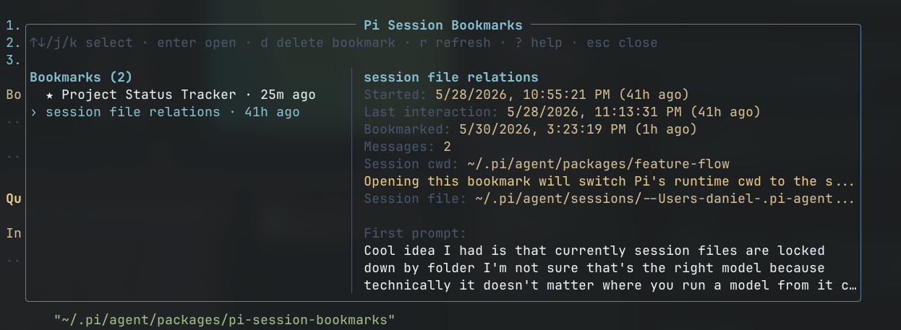

# pi-session-bookmarks

You had a good idea, but now you need to switch contexts?  
Make a bookmark and keep track of important Pi sessions across workspaces. Easy `/bookmark` and `/bookmark-list` makes it easy to hop back in.



## Usage

```text
/bookmark [note]   bookmark the current Pi session
/bookmark-list     browse all bookmarked sessions
/unbookmark        remove the current session bookmark
```

Typical flow:

1. Run `/bookmark new app idea: tinder for horses` in a session you want to keep.
2. Later, from any workspace, run `/bookmark-list`.
3. Pick the session and press Enter to resume it.

Bookmarks are global, not tied to the current cwd. They are stored at:

```text
~/.pi/agent/session-bookmarks/bookmarks.json
```

## Quickstart

Install with Pi:

```bash
pi install npm:pi-session-bookmarks
```

Then restart Pi or run `/reload`.

## cwd

`/bookmark-list` allows switching the current Pi session. If the bookmarked session belongs to another workspace, Pi's runtime cwd changes to that session's cwd. Your outer shell's cwd is unchanged.
